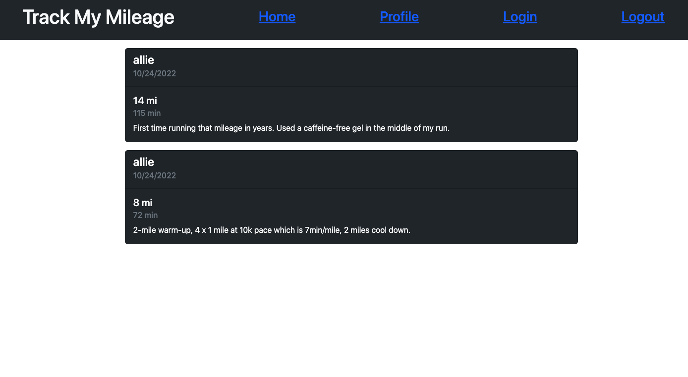
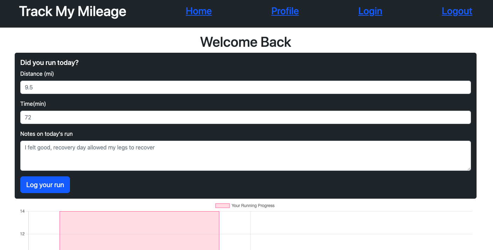

# Track my mileage 

## Description

Track my mileage was built using MVC framework Handlebars.js and allows the user to track thier running progression on their profile page. Having ran at a the NCAA Div 1 level and currently still running. I drew inpiration from my background in running to build a project that would align with my personal interests. The homepage displays see runs that are being logged in by all users so that an indiviual runner can draw inspiration from other users. While building this app, I developed my ability to use Chart.js to dynamically populate the runs logged in by the user. Some of the challenges that I faced 

## Installation

The webapp is deployed on Heroku and can be accessed via the following link. 

## Usage

The first thing displayed is the homepage where runs from all users are displayed as posts. To access a personal profile, click login on the top of the screen. From there, the user will be prompted to either sign into your account or sign up for a new account. Once the form is filled out, the user will be redirected to your personal profile. To log in a run, fill out the form on the profile page. Once that is filled in, and the user hit submit, the graph will change to reflect the run and a new journal entry will be added to the bottom of the page. To go back to the homepage. Click home at the top of the screen. 

## Credits

This project was done in collaboration with Ben Hobson. 

TA Meg Meyers and Professor Diarmuid Murphy helped troubleshooting the code. 

Chart.js was used 

## License

MIT License

Copyright (c) [2022] [AlejandraQuintero]

Permission is hereby granted, free of charge, to any person obtaining a copy
of this software and associated documentation files (the "Software"), to deal
in the Software without restriction, including without limitation the rights
to use, copy, modify, merge, publish, distribute, sublicense, and/or sell
copies of the Software, and to permit persons to whom the Software is
furnished to do so, subject to the following conditions:

The above copyright notice and this permission notice shall be included in all
copies or substantial portions of the Software.

THE SOFTWARE IS PROVIDED "AS IS", WITHOUT WARRANTY OF ANY KIND, EXPRESS OR
IMPLIED, INCLUDING BUT NOT LIMITED TO THE WARRANTIES OF MERCHANTABILITY,
FITNESS FOR A PARTICULAR PURPOSE AND NONINFRINGEMENT. IN NO EVENT SHALL THE
AUTHORS OR COPYRIGHT HOLDERS BE LIABLE FOR ANY CLAIM, DAMAGES OR OTHER
LIABILITY, WHETHER IN AN ACTION OF CONTRACT, TORT OR OTHERWISE, ARISING FROM,
OUT OF OR IN CONNECTION WITH THE SOFTWARE OR THE USE OR OTHER DEALINGS IN THE
SOFTWARE.

---

## Features

The website uses user authentification 

